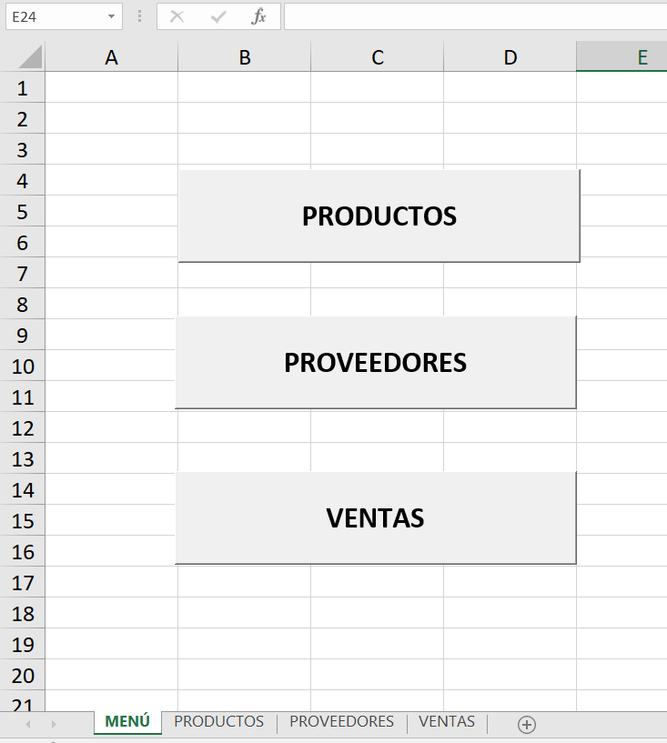
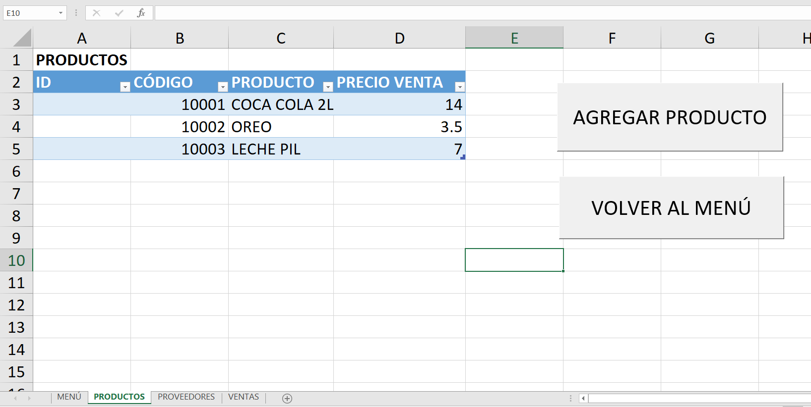
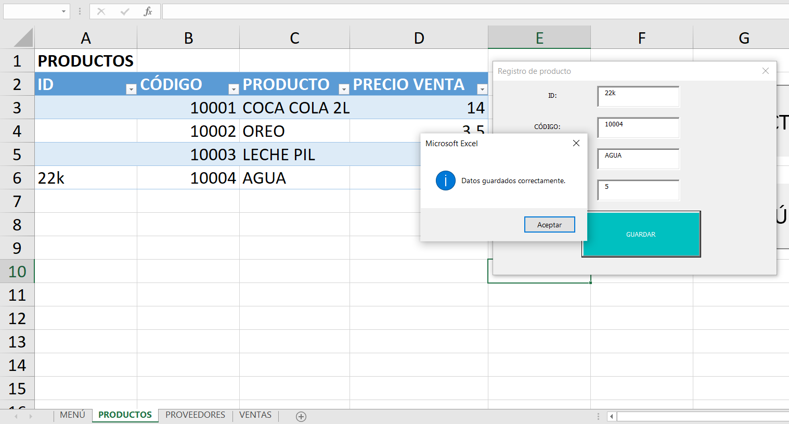
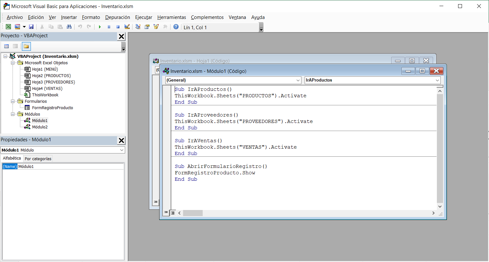

# OTM106_practica3

La práctica consiste en la elaboración de un formulario de registro de productos para un inventario con excel y visual basic

## Captura Menú:

En la hoja Menú se craeron 3 botones para acceder a las hojas de productos, proveedores y ventas

## Captura Productos:

En la hoja productos se creó una tabla dinámica para registrar los productos

## Captura Registro:

Al hacer click en agregar producto aparece el formulario de registro, el cual debe ser llenado

## Captura Módulos:

Código de Módulos

## Captura Formulario_de_registro:

Código del formulario de registro
