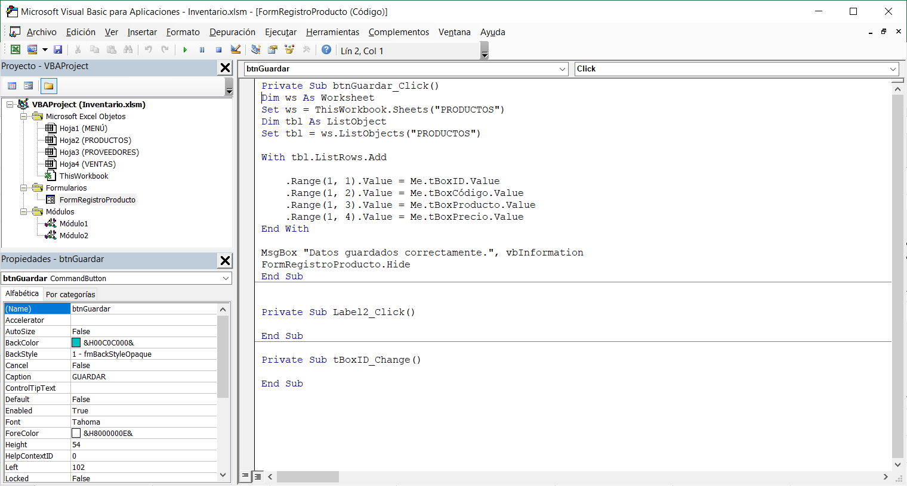

# OTM106_practica3

La práctica consiste en la elaboración de un formulario de registro de productos para un inventario con excel y visual basic

## Captura Menú:

## Captura Productos:

## Captura Registro:

## Captura Módulos:

## Captura Formulario de registro:

